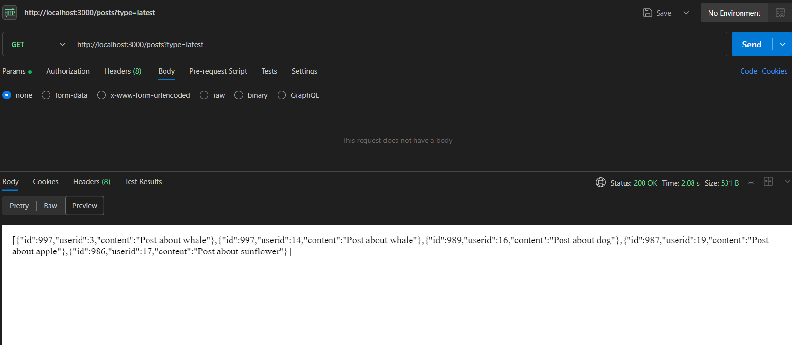

# Question1:-Social Media Analytical HTTP Microservices

## Backend API for User and Post Analytics.

## Features Implemented

1. **Dynamic Access Token Fetching**:
   - A function `fetchAccessToken` dynamically fetches the access token from the test server (`http://20.244.56.144/test/auth`) using the provided credentials.
   - The token is fetched every time a request is made to avoid token expiry issues.

2. **Environment Variables**:
   - Sensitive information such as API URLs, credentials, and other configurations are stored in a `.env` file for security.
   - The `.env` file includes:
     ```
     AUTH_URL
     COMPANY_NAME
     CLIENT_ID
     CLIENT_SECRET
     OWNER_NAME
     OWNER_EMAIL
     ROLL_NO
     ```

3. **Endpoints**:
   - **`GET /users`**:
     - Fetches all users from the test server (`http://20.244.56.144/test/users`).
     - Fetches posts for each user from `http://20.244.56.144/test/users/:userId/posts`.
     - Sorts users by the number of posts in descending order.
     - Returns the top 5 users with the highest post counts.
   - **Example Response**:
     ```json
     [
       { "id": "1", "name": "John Doe", "postCount": 10 },
       { "id": "2", "name": "Jane Doe", "postCount": 8 },
       { "id": "3", "name": "Alice Smith", "postCount": 7 },
       { "id": "4", "name": "Bob Johnson", "postCount": 6 },
       { "id": "5", "name": "Charlie Brown", "postCount": 5 }
     ]
     ```
    ## Postmon Response
       usersResponse.png
   - **`GET /posts`**:
     - Fetches posts for all users from `http://20.244.56.144/test/users/:userId/posts`.
     - Supports two query parameters:
       - `type=popular`: Fetches all posts and determines the post(s) with the highest number of comments by querying `http://20.244.56.144/test/posts/:postId/comments`.
       - `type=latest`: Sorts all posts by their `createdAt` property in descending order and returns the latest 5 posts.
   - **Example Responses**:
     - **Popular Posts**:
       ## Postmon Response
           populorresponse.png

      - **latest Posts**:
      - the latest posts are returning an empty array I will try to fix that but currently it is not showing any data 
      - OK now It is working. I have modified the sorting by sorting on the basis of post id since latest post id have highest number 
         ## Postmon Response
            


4. **Sorting and Filtering**:
   - Users are sorted by their post counts using comparison sorting.
   - Posts are sorted by their `createdAt` property for the `latest` type.
   - Posts with the highest number of comments are identified for the `popular` type.

5. **Error Handling**:
   - Proper error handling is implemented for all API requests.
   - Errors are logged to the console for debugging purposes.

## How to Run

1. **Install Dependencies**:
   ```bash
   npm install
   ```

2. **Set Up Environment Variables**:
   - Create a `.env` file in the root directory and add the required variables as shown above.

3. **Start the Server**:
   ```bash
   node server.js
   ```

4. **Test the Endpoints**:
   - Use tools like Postman or `curl` to test the endpoints:
     - `GET /users`: Returns the top 5 users sorted by post count.
     - `GET /posts?type=popular`: Returns the post(s) with the highest number of comments.
     - `GET /posts?type=latest`: Returns the latest 5 posts sorted by creation date.


